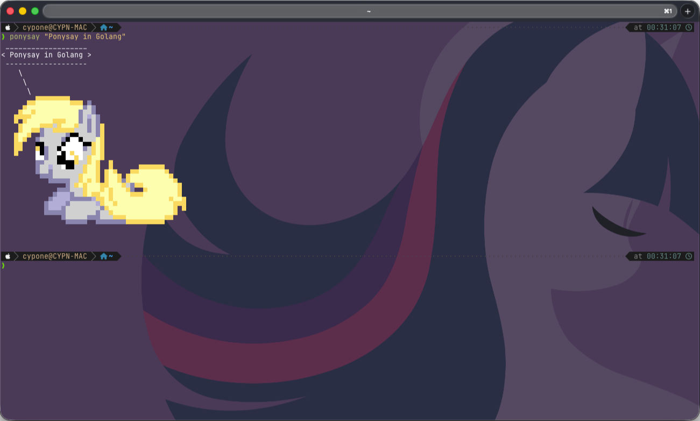
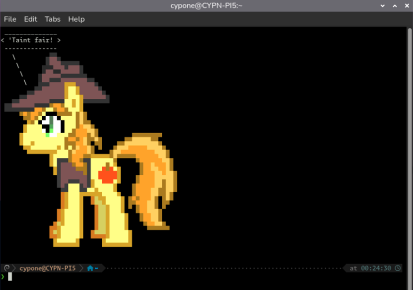
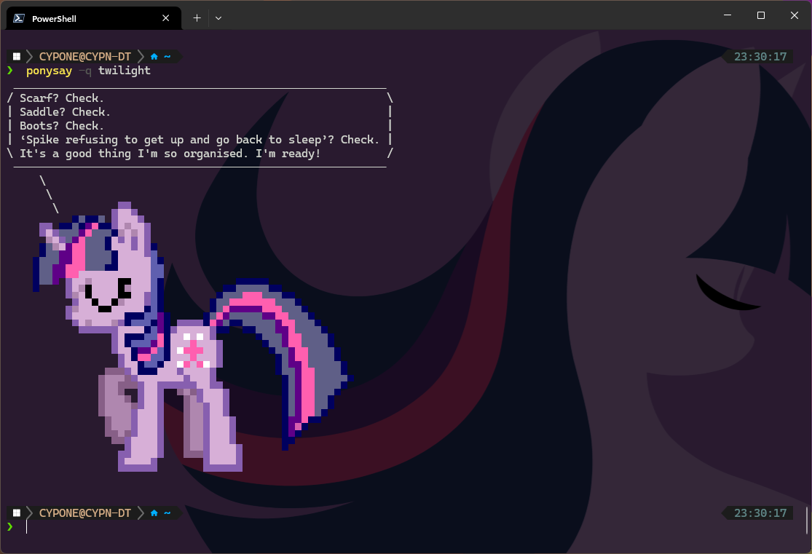
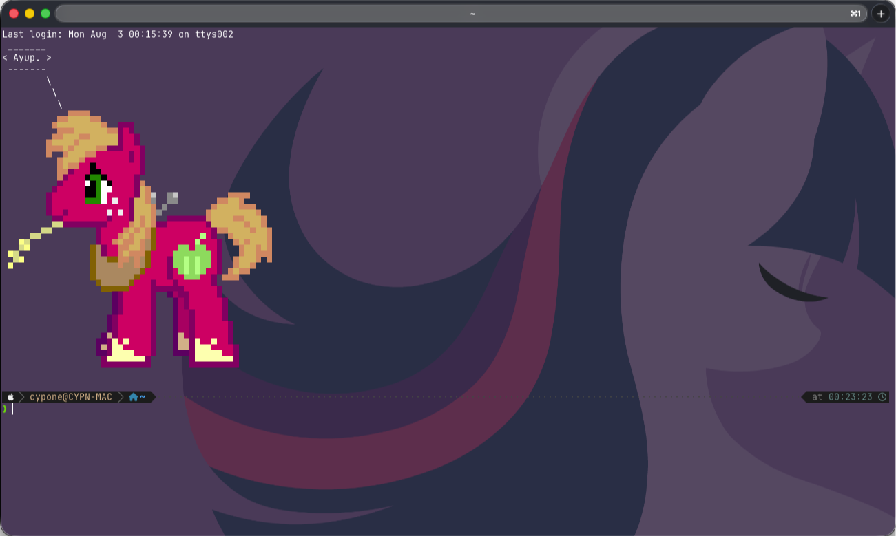
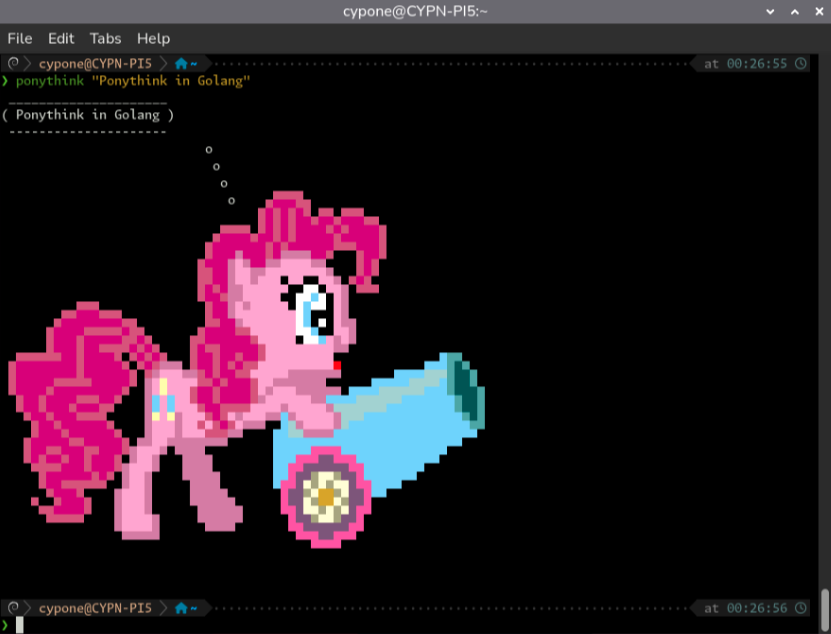
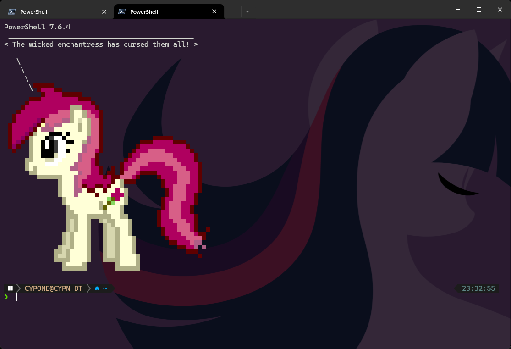

# ponysay-go

Cross-platform Go port of [ponysay](https://github.com/erkin/ponysay) (cowsay reimplementation for ponies).

> [!NOTE]
> Personal project created strictly for fun. Maintainer is not responsible for ongoing support.

---

## Features

- **Zero External Dependencies**: Single self-contained binary (`//go:embed`). No Python or `coreutils`/`stty` required.
- **Blazing Fast**: Sub-5ms startup time for shell startup scripts (`fortune | ponysay`).
- **True Cross-Platform**: Native binaries for Windows (Cmd, PowerShell, Windows Terminal), macOS, Linux, and FreeBSD.
- **Hybrid Asset Engine**: Embedded assets out-of-the-box with local disk override support (`~/.config/ponysay/ponies`).
- **Full Feature Parity**: Speech (`ponysay`), thought (`ponythink`), quote database (`-q`), custom balloon borders (`-b`), word wrapping (`-W`), and info metadata (`-i`).

---

## Screenshots

| macOS | Linux | Windows |
| :---: | :---: | :---: |
|  |  |  |

<details>
<summary>More Screenshots</summary>

| macOS (Quote) | Linux (Quote) | Windows (Quote) |
| :---: | :---: | :---: |
|  |  |  |

</details>

---

## Installation

### Quick Install (Recommended)

**Linux & macOS (Bash / Zsh):**
```bash
curl -fsSL https://raw.githubusercontent.com/bradly0cjw/ponysay-go/mane/install.sh | bash
```

**Windows (PowerShell):**
```powershell
irm https://raw.githubusercontent.com/bradly0cjw/ponysay-go/mane/install.ps1 | iex
```

*Detects OS and architecture automatically. Installs globally with admin/root privileges, or to user directory (`~/.local/bin` / `%LocalAppData%\Programs\ponysay`) without admin/root.*

<details>
<summary>Manual & Alternative Installation Options</summary>

#### Prebuilt Release Binary
Download the latest binary for your platform from [GitHub Releases](https://github.com/bradly0cjw/ponysay-go/releases):
- **Linux / macOS**: Place binary in `/usr/local/bin` (global) or `~/.local/bin` (user). Symlink `ponythink` -> `ponysay`.
- **Windows**: Place `ponysay.exe` in Program Files or `%LocalAppData%\Programs\ponysay`, copy as `ponythink.exe`, and add folder to `PATH`.

#### Go CLI
```bash
go install github.com/bradly0cjw/ponysay-go/cmd/ponysay@latest
```

#### Build from Source
```bash
git clone https://github.com/bradly0cjw/ponysay-go.git
cd ponysay-go
go build -o ponysay ./cmd/ponysay
ln -s ponysay ponythink
```
</details>

### Uninstallation

<details>
<summary>Uninstall Instructions</summary>

**Linux & macOS:**
```bash
curl -fsSL https://raw.githubusercontent.com/bradly0cjw/ponysay-go/mane/uninstall.sh | bash
```

**Windows (PowerShell):**
```powershell
irm https://raw.githubusercontent.com/bradly0cjw/ponysay-go/mane/uninstall.ps1 | iex
```
</details>

---

## Usage

```bash
# Speech & Thought Balloons
ponysay "I am just the cutest pony!"
ponythink "Hmm... is Golang fast?"

# Pony Selection & Quotes
ponysay -f pinkie "Partay!~"       # Select specific pony
ponysay +f cow "Moo!"             # Select extra/non-MLP pony
ponysay -q pinkie                  # Print quote from Pinkie Pie
ponysay -q                         # Print random pony quote

# Shell Startup Hook (~/.bashrc or ~/.zshrc)
fortune | ponysay

# Balloon Styles & Formatting
ponysay -b unicode "Box border"   # Styles: cowsay, unicode, ascii, etc.
ponysay -f derpy -o               # Artwork only (no balloon)
ponysay -f derpy -i               # Print pony metadata info

# Listing Options
ponysay -l                        # List MLP ponies (-A for all, +l for extra)
ponysay -B                        # List balloon styles
ponysay --quoters                 # List ponies that have quotes

# Self Update
ponysay update                    # Download and install latest GitHub release
```

---

## Custom Assets

Assets are resolved using a hybrid lookup order:
1. **Local Disk**: Checks `./ponies/`, `~/.config/ponysay/ponies/`, and `/usr/share/ponysay/`
2. **Embedded Fallback**: Embedded binary assets.

To add a custom pony file without recompiling:
```bash
mkdir -p ~/.config/ponysay/ponies
cp mycustompony.pony ~/.config/ponysay/ponies/
ponysay -f mycustompony "Hello world!"
```

---

## CLI Options

| Flag / Command | Short / Alias | Description |
| :--- | :--- | :--- |
| `--file PONY` | `-f`, `+f`, `-F` | Select MLP (`-f`), extra (`+f`), or any (`-F`) pony |
| `--files PONY...` | `--f`, `++f`, `--F` | Variadic pony selection |
| `--quote [PONY]` | `-q`, `--q` | Select pony quote (specific pony or random) |
| `--bubble STYLE` | `-b` | Select balloon style (`cowsay`, `unicode`, `ascii`, etc.) |
| `--wrap`, `--compress` | `-W COLUMN`, `-c` | Maximum wrap width (`-W`), compress empty lines (`-c`) |
| `--list`, `--all` | `-l`, `+l`, `-A` | List MLP (`-l`), extra (`+l`), or all (`-A`) ponies |
| `--symlist`, `--bubblelist` | `-L`, `-B`, `--quoters` | List aliases (`-L`), balloon styles (`-B`), or quoter list |
| `--onelist` | | Single-line list output format |
| `--info`, `--pony-only` | `-i`, `+i`, `-o` | Metadata info (`-i`/`+i`), artwork only (`-o`) |
| `--256-colours` | `-X`, `-V`, `-K` | Color modes: 256 (`-X`), TTY 16 (`-V`), KMS (`-K`) |
| `update` | `-u`, `--update` | Update binary to latest release from GitHub |
| `--version`, `--help` | `-v`, `-h` | Display version (`-v`) or help menu (`-h`) |

---

## Python vs Go Comparison

| Feature | Original Python `ponysay` | Go Port (`ponysay-go`) |
| :--- | :--- | :--- |
| **Platform Support** | Linux / macOS (Windows via WSL/Cygwin) | Native Windows (`.exe`), macOS, Linux, FreeBSD |
| **Dependencies** | Python 3, `coreutils` (`stty`), `setup.py` | Single self-contained binary (zero dependencies) |
| **Performance** | Python interpreter startup overhead | Native binary (sub-5ms execution) |
| **Terminal Detection**| Shell call `stty size` | Native OS syscalls (`golang.org/x/term`) |
| **Feature Parity** | Speech, thought, quotes, styles, wrapping | 100% complete feature parity |

---

## Development

```bash
# Run unit and integration tests
go test -v ./...
```

---

## Credits & License

Reimplementation of the original Python **[ponysay](https://github.com/erkin/ponysay)** created by [Erkin Batu Altunbaş](https://github.com/erkin), [Mattias Andrée](https://github.com/maandree), [Pablo Lezaeta](https://github.com/jristz), and community contributors. Artwork sourced from [Browser Ponies](https://panzi.github.io/Browser-Ponies/) and Desktop Ponies.

See [CREDITS](CREDITS) for asset attributions and [LICENCE](LICENCE) for license details.
